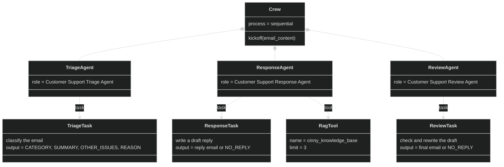

# Rapport

## What I built and why

I work on an app called Cinny, which is a movie and series tracking app. So I wanted to build something that could help us with this app. I thought a support agent that could check our email, classify it and draft answers would be a good thing to have. Then we can spend our time on the more fun parts, which is building the app and not answering emails.

So this is more like a proof of concept than the final product. I think the idea will work, but it needs more work to be a complete product. So we start with a small task. Some of the mails we're getting are spam, which are emails we don't want. And some are questions about the app.

The RAG will help the agent to answer questions about the app. So I have added some documents from the Cinny app. So the agent can answer questions about the app. The agent will also classify the emails into spam or other classifications. If it is not spam it will try to answer the question. If it is spam it will just say that it is spam and not provide a draft.

The retrieval will help in answering questions about the app, because the models are not trained on the Cinny app. So now it will look and try to find information about the app in the documents.

## Your agent and task design

I have three agents. The first one is the triage agent, which classifies the emails into spam or one of the other categories. The second one is the response agent, which writes a draft reply and is the only agent that has the RAG tool, so it can look up answers about the app. The third one is the review agent, which checks the draft and makes sure it is correct and friendly. The crew runs in sequential mode.



### Agents

```python
import os
from crewai import Agent
from dataclasses import dataclass, field
from llm import llm
from tools import rag_tool

# Definition schema
@dataclass
class agent_definition:
    role: str
    goal: str
    backstory: str
    tools: list = field(default_factory=list)
    allow_delegation: bool = False
    verbose: bool = True

# Create definitions of the agents
def get_agents():
  triage_agent = agent_definition(
    role="Customer Support Triage Agent",
    goal="Decide whether an incoming email is a genuine Cinny support request and, if so, classify it into exactly one support category.",
    backstory=(
      "You work in the support team at Cinny, an app for tracking movies and TV series: "
      "users keep watchlists, mark episodes as watched and get notified about new releases. "
      "You read every incoming email first. You are quick to spot spam, phishing and marketing, "
      "and you know the difference between a bug, a data error and a feature request. "
      "You never answer customers yourself; you only classify."
    ),
  )

  response_agent = agent_definition(
    role="Customer Support Response Agent",
    goal="Write a friendly, accurate reply in English to a Cinny user that solves their problem or clearly explains the next step.",
    backstory=(
      "You are a support specialist at Cinny who loves movies and TV and knows the app inside out. "
      "You write warm, casual and concise emails, like a helpful friend rather than a corporation. "
      "You only state facts that come from Cinny's FAQ and documentation; if you don't know something, "
      "you say the team will look into it instead of guessing. You never promise refunds, release dates "
      "or features that haven't been confirmed."
      "If you dont know the answer, dont make it up."
    ),
    tools=[rag_tool()],
  )

  review_agent = agent_definition(
    role="Customer Support Review Agent",
    goal="Make sure every reply that leaves Cinny is correct, on-brand and actually answers the customer, rewriting it when needed.",
    backstory=(
      "You are the support lead at Cinny and the last check before an email is sent. "
      "You compare the draft with the customer's original email and check that every question is answered, "
      "that nothing is made up, and that the tone is friendly, casual English. "
      "Instead of sending feedback back, you fix problems yourself and deliver the final email."
      "Never write or answer questions that your not sure about. If you dont know the answer, say that the team will look into it instead of guessing."
    ),
  )

  return [triage_agent, response_agent, review_agent]


def create_agent(definition: agent_definition):
    return Agent(
        role=definition.role,
        goal=definition.goal,
        backstory=definition.backstory,
        tools=definition.tools,
        allow_delegation=definition.allow_delegation,
        verbose=definition.verbose,
        llm=llm,
    )
```

### Tasks

```python
from dataclasses import dataclass, field
from crewai import Task

@dataclass
class TaskDefinition:
    description: str
    expected_output: str
    agent_role: str  # Role of the agent assigned to this task
    context_tasks: list = field(default_factory=list)

# The customer email goes first and is clearly labelled, so small models don't
# mistake it for the text they are supposed to output
CUSTOMER_EMAIL = (
    "=== CUSTOMER EMAIL (input only, never copy it as your answer) ===\n"
    "{email_content}\n"
    "=== END OF CUSTOMER EMAIL ===\n\n"
)

def get_tasks():
    triage_task = TaskDefinition(
        description=(
            CUSTOMER_EMAIL
            + "Classify the customer email above.\n\n"
            "First decide if it is relevant: a real message from a person about the Cinny app. "
            "Spam, phishing, newsletters, ads and messages unrelated to Cinny are SPAM.\n\n"
            "If relevant, pick exactly one main category:\n"
            "- ACCOUNT: login, password reset, deleting the account, sync between devices\n"
            "- BUG: crashes, lost watchlists or history, notifications not working, UI problems\n"
            "- DATA_ERROR: wrong or missing movie/series info, e.g. episodes, seasons, release dates, streaming services\n"
            "- FEEDBACK: feature requests, suggestions, praise or complaints about the app\n"
            "- OTHER: relevant to Cinny but fits none of the above\n\n"
            "If the email contains more than one issue, list the rest under OTHER_ISSUES."
        ),
        expected_output=(
            "Exactly four lines:\n"
            "CATEGORY: <SPAM | ACCOUNT | BUG | DATA_ERROR | FEEDBACK | OTHER>\n"
            "SUMMARY: <one sentence describing what the customer wants>\n"
            "OTHER_ISSUES: <further issues with their category, or NONE>\n"
            "REASON: <one sentence explaining the classification>"
        ),
        agent_role="Customer Support Triage Agent",
    )

    response_task = TaskDefinition(
        description=(
            CUSTOMER_EMAIL
            + "You are The Cinny Team. Write a reply TO the customer who sent the email above, "
            "using the triage result from the previous task.\n\n"
            "If the category is SPAM, do not write a reply; output only NO_REPLY.\n\n"
            "Otherwise, address every issue (CATEGORY and OTHER_ISSUES) in friendly, casual English:\n"
            "- ACCOUNT: give the steps to fix it; never ask for their password\n"
            "- BUG: apologize and ask for device, OS and app version if missing\n"
            "- DATA_ERROR: thank them and say the title's info will be checked and corrected\n"
            "- FEEDBACK: thank them and say it is passed on to the product team; promise nothing\n"
            "- OTHER: answer as best you can, or say the team will get back to them\n\n"
            "Never describe menus, buttons or steps in the app unless you know they exist. "
            "Do not invent features, prices or dates."
        ),
        expected_output=(
            "Either NO_REPLY, or a reply email to the customer: a greeting using their name, "
            "a short body (max ~150 words) and the sign-off 'The Cinny Team'."
        ),
        agent_role="Customer Support Response Agent",
    )

    review_task = TaskDefinition(
        description=(
            CUSTOMER_EMAIL
            + "The previous task wrote a draft reply from The Cinny Team to this customer. "
            "Review that DRAFT REPLY, not the customer email.\n\n"
            "If the draft is NO_REPLY, output NO_REPLY.\n\n"
            "Otherwise, check that the draft:\n"
            "1. Is written to the customer and signed 'The Cinny Team'\n"
            "2. Answers every issue the customer raised\n"
            "3. Contains no made-up facts, app steps, promises or dates\n"
            "4. Is in friendly, casual English and under ~150 words\n"
            "5. Never asks for passwords or payment details\n\n"
            "If it passes, keep it as is. If not, rewrite it so it does."
        ),
        expected_output=(
            "Either NO_REPLY, or only the final reply email from The Cinny Team to the customer, "
            "ready to send, with no comments or explanations. Never the customer's own email."
        ),
        agent_role="Customer Support Review Agent",
    )

    return [triage_task, response_task, review_task]

def create_task(definition: TaskDefinition, agent):
    return Task(
        description=definition.description,
        expected_output=definition.expected_output,
        agent=agent,
    )

```

### Crew

```python
from agents import create_agent, get_agents
from tasks import create_task, get_tasks
from crewai import Crew

def create_crew():
  agents = get_agents()
  tasks = get_tasks()
  
  for i in range(len(agents)):
    agent = create_agent(agents[i])
    task = create_task(tasks[i], agent)

    # print(f"Assigned task: {task.description} to agent: {agent.role}")

    agents[i] = agent
    tasks[i] = task

  return Crew(
      agents=agents,
      tasks=tasks
  )
```

## How the retrieval integration works

The agent can call the rag tool when it needs to answer a question about the app. The rag tool will then look into the documents and try to find information about the app. The agent will then use this information to answer the question.

The information it sees is what the app is and some common questions, together with the privacy policy and terms of service.

### Rag tool

```python
from crewai_tools import RagTool
from crewai_tools.tools.rag import RagToolConfig, ProviderSpec
from pydantic import BaseModel, Field

COLLECTION_NAME = "cinny-collection"

def rag_tool():
  embedding_model: ProviderSpec = {
    "provider": "ollama",
    "config": {
      "model_name": "nomic-embed-text-v2-moe",
      "url": "http://localhost:11434/api/embeddings"
    }
  }

  # Chroma is the default vector DB. The collection name is a RagTool field,
  # not part of the vectordb config
  config: RagToolConfig = {
    "embedding_model": embedding_model
  }

  # The agent only sees name + description when deciding whether to use the tool;
  # the RagTool default is too generic, so spell out when it must be used
  tool = RagTool(
    config=config,
    collection_name=COLLECTION_NAME,
    limit=3, # Dont fill the whole count
    name="cinny_knowledge_base",
    description=(
      "Search Cinny's official FAQ and documentation. "
      "ALWAYS use this before answering any customer question about Cinny, "
      "e.g. pricing, Cinny Plus, account, data export, deletion, features or supported devices. "
      "Search once per question. If it returns nothing relevant, the answer is unknown: do not guess."
    ),
  )

  # Clear the collection.
  client = tool.adapter._client
  client.delete_collection(collection_name=COLLECTION_NAME)
  client.get_or_create_collection(collection_name=COLLECTION_NAME)

  # Documents
  doc_paths = [
    "data/cinny-overview.md",
    "data/pricing-faq.md",
    "data/account-faq.md",
    "data/privacy-policy.md",
    "data/terms-and-conditions.md",
  ]

  for doc_path in doc_paths:
    tool.add(data_type="file", path=doc_path)

  return tool
```

Here I have used the CrewAI RAG tool instead of implementing my own. So first we set up the embedding model and the correct collection name. Then we add the documents to the collection. The agent can then use this tool to search for information about the app. We have a limit of 3 so we don't fill the whole context window with information. The agent will then use this information to answer the question.

Example of what the agent sees when it uses the rag tool:

```markdown
Tool cinny_knowledge_base executed with result: Relevant Content:
# Cinny account FAQ

##
## How do I sign in to Cinny?

You can sign in with email and password, Google, or Apple. If you sign up with email, you confirm your address with a 6-digit ...
```

## The comparison for requirement 4

The email I tested with:

```markdown
Subject: A few questions before I upgrade

Hi Cinny team,

I'm thinking about upgrading to Cinny Plus. How much does it cost, and can I cancel anytime?

Also, before I do: is there a way to export my watch history? I've tracked over 300 movies
and I don't want to lose them. And if I end up deleting my account, how long until my data
is actually gone?

Thanks!
Nora
```

The answer without RAG:

```markdown
Dear Nora,

Thanks for reaching out to us about upgrading to Cinny Plus and having some questions! We'd be happy to help.

To start, upgrading to Cinny Plus typically becomes available every few months, and the cost is part of our subscription model. However, I don't have the most up-to-date pricing information, so I recommend checking our website for the latest pricing details.

Regarding your watch history, we can't find any information on exporting it from within the app, but we're happy to explore this feature as a potential addition in the future. We'll pass on your feedback to our product team.

If you decide to cancel your subscription, your data will be deleted 30 days after the cancellation process is complete.

Thanks again for your feedback, Nora! We appreciate it.

The Cinny Team
```

The answer with RAG:

```markdown
Dear Nora,

Thank you for reaching out to Cinny's support team. We're happy to help you with your questions about upgrading to Cinny Plus.

Cinny Plus is an optional paid upgrade on top of the free app. The plan costs $3.99 per month or $24.99 per year (about $2.08 per month, 48% less than paying monthly). You can also cancel your subscription anytime.

Before upgrading, you can review our FAQ to understand the additional features that come with Cinny Plus, such as unlimited discovery, more control, and deeper insight into your own viewing. To export your watch history, go to 'Watch History' in the app, and select 'Export'. Your data will be available for 90 days after you delete your account.

If you have any specific questions or would like to know more about the pricing, please feel free to ask. We're here to help.

Best regards,
The Cinny Team
```

### Analysis

The two answers come from the same email and the same agents and tasks. The only difference is that the Response Agent had the `cinny_knowledge_base` tool in the second run. Each answer is from a single run. The model gives slightly different answers every time, so a single run only shows the typical behaviour.

| Question in the email | Correct answer (from the documents) | Without RAG | With RAG |
|---|---|---|---|
| Price of Cinny Plus | $3.99/month, $24.99/year, $79.99 lifetime | Unknown, refers to the website | Correct monthly and yearly price (lifetime missing) |
| Can I cancel anytime? | Yes, through the App Store or Google Play | Not answered | Correct ("cancel anytime") |
| Can I export my watch history? | No self-service export yet, email info@codesquare.se | Roughly correct: says it can't be found | Wrong: invents a "Watch History > Export" menu |
| How long until my data is gone? | Immediately when the deletion is confirmed | Wrong: "30 days" | Wrong: "90 days" |

## The sequential against hierarchical comparison

I ran the same email from Nora with RAG on, first with the normal sequential crew and then with `process=Process.hierarchical`. In hierarchical mode a manager agent decides which agent does what, and the agents only get the text the manager sends them, not my task descriptions.

Hierarchical didn't work for me. I tried three different managers:

1. **Default manager (llama3.2:3b).** It didn't pass on the email, so the Triage Agent only got "What category does this email belong to?". Then the manager wrote the reply itself, with a made up price and made up features.
2. **My own manager (llama3.2:3b).** I told it to delegate in the right order and always include the email. It did include the email, but it wrote the tool call as text instead of calling the tool, so no agent ran.
3. **My own manager (qwen2.5:3b).** The delegation finally worked and the Triage Agent classified the email correctly. But the manager sent it to triage twice, never went on to the Response and Review Agents, and ended with `NO_REPLY`.

| | Agents that ran | RAG used | LLM requests | Time | Final answer |
|---|---|---|---|---|---|
| Sequential | All three | Yes | 12 | 125 s | An email to Nora |
| Default manager (llama3.2:3b) | Triage | No | 24 | 75 s | Made up email |
| Own manager (llama3.2:3b) | None | No | 12 | 36 s | Tool call as text |
| Own manager (qwen2.5:3b) | Triage (twice) | No | 15 | 192 s | `NO_REPLY` |

For my system sequential is better. The steps are always the same (classify, answer, review), so there is nothing for a manager to decide. Hierarchical depends on the manager making real tool calls, and the small models couldn't do that. It would make more sense with one agent per category and a bigger manager model, but I didn't have time to test that.

## Screenshots and the exact commands and prompts you used

The prompts for each agent and task can be found above.

```bash
╭─────────────────────────────────────────────────────── 🤖 Agent Started ────────────────────────────────────────────────────────╮
│                                                                                                                                 │
│  Agent: Customer Support Triage Agent                                                                                           │
│                                                                                                                                 │
│  Task: === CUSTOMER EMAIL (input only, never copy it as your answer) ===                                                        │
│  Subject: A few questions before I upgrade                                                                                      │
│                                                                                                                                 │
│  Hi Cinny team,                                                                                                                 │
│                                                                                                                                 │
│  I'm thinking about upgrading to Cinny Plus. How much does it cost, and can I cancel anytime?                                   │
│                                                                                                                                 │
│  Also, before I do: is there a way to export my watch history? I've tracked over 300 movies                                     │
│  and I don't want to lose them. And if I end up deleting my account, how long until my data                                     │
│  is actually gone?                                                                                                              │
│                                                                                                                                 │
│  Thanks!                                                                                                                        │
│  Nora                                                                                                                           │
│  === END OF CUSTOMER EMAIL ===                                                                                                  │
│                                                                                                                                 │
│  Classify the customer email above.                                                                                             │
│                                                                                                                                 │
│  First decide if it is relevant: a real message from a person about the Cinny app. Spam, phishing, newsletters, ads and         │
│  messages unrelated to Cinny are SPAM.                                                                                          │
│                                                                                                                                 │
│  If relevant, pick exactly one main category:                                                                                   │
│  - ACCOUNT: login, password reset, deleting the account, sync between devices                                                   │
│  - BUG: crashes, lost watchlists or history, notifications not working, UI problems                                             │
│  - DATA_ERROR: wrong or missing movie/series info, e.g. episodes, seasons, release dates, streaming services                    │
│  - FEEDBACK: feature requests, suggestions, praise or complaints about the app                                                  │
│  - OTHER: relevant to Cinny but fits none of the above                                                                          │
│                                                                                                                                 │
│  If the email contains more than one issue, list the rest under OTHER_ISSUES.                                                   │
│                                                                                                                                 │
╰─────────────────────────────────────────────────────────────────────────────────────────────────────────────────────────────────╯

[Finalize] todos_count=0, todos_with_results=0
╭───────────────────────────────────────────────────── ✅ Agent Final Answer ─────────────────────────────────────────────────────╮
│                                                                                                                                 │
│  Agent: Customer Support Triage Agent                                                                                           │
│                                                                                                                                 │
│  Final Answer:                                                                                                                  │
│  CATEGORY: FEEDBACK                                                                                                             │
│  SUMMARY: The customer is inquiring about the upgrade options and features for Cinny Plus.                                      │
│  OTHER ISSUES:  None                                                                                                            │
│  REASON: The email contains a question about the cost of upgrading to Cinny Plus, which indicates that the customer is seeking  │
│  information about a new feature or subscription option, making it a feedback request.                                          │
│                                                                                                                                 │
╰─────────────────────────────────────────────────────────────────────────────────────────────────────────────────────────────────╯

╭─────────────────────────────────────────────────────── 🤖 Agent Started ────────────────────────────────────────────────────────╮
│                                                                                                                                 │
│  Agent: Customer Support Response Agent                                                                                         │
│                                                                                                                                 │
│  Task: === CUSTOMER EMAIL (input only, never copy it as your answer) ===                                                        │
│  Subject: A few questions before I upgrade                                                                                      │
│                                                                                                                                 │
│  Hi Cinny team,                                                                                                                 │
│                                                                                                                                 │
│  I'm thinking about upgrading to Cinny Plus. How much does it cost, and can I cancel anytime?                                   │
│                                                                                                                                 │
│  Also, before I do: is there a way to export my watch history? I've tracked over 300 movies                                     │
│  and I don't want to lose them. And if I end up deleting my account, how long until my data                                     │
│  is actually gone?                                                                                                              │
│                                                                                                                                 │
│  Thanks!                                                                                                                        │
│  Nora                                                                                                                           │
│  === END OF CUSTOMER EMAIL ===                                                                                                  │
│                                                                                                                                 │
│  You are The Cinny Team. Write a reply TO the customer who sent the email above, using the triage result from the previous      │
│  task.                                                                                                                          │
│                                                                                                                                 │
│  If the category is SPAM, do not write a reply; output only NO_REPLY.                                                           │
│                                                                                                                                 │
│  Otherwise, address every issue (CATEGORY and OTHER_ISSUES) in friendly, casual English:                                        │
│  - ACCOUNT: give the steps to fix it; never ask for their password                                                              │
│  - BUG: apologize and ask for device, OS and app version if missing                                                             │
│  - DATA_ERROR: thank them and say the title's info will be checked and corrected                                                │
│  - FEEDBACK: thank them and say it is passed on to the product team; promise nothing                                            │
│  - OTHER: answer as best you can, or say the team will get back to them                                                         │
│                                                                                                                                 │
│  Never describe menus, buttons or steps in the app unless you know they exist. Do not invent features, prices or dates.         │
│                                                                                                                                 │
╰─────────────────────────────────────────────────────────────────────────────────────────────────────────────────────────────────╯

Tool cinny_knowledge_base executed with result: Relevant Content:
# Cinny pricing FAQ

##
## Is Cinny free?

Yes. Cinny is free to use, and everything you need to track movies and TV series is free with no caps:

- Unlimited logging, ratings, revi...
[Finalize] todos_count=0, todos_with_results=0
╭───────────────────────────────────────────────────── ✅ Agent Final Answer ─────────────────────────────────────────────────────╮
│                                                                                                                                 │
│  Agent: Customer Support Response Agent                                                                                         │
│                                                                                                                                 │
│  Final Answer:                                                                                                                  │
│  Dear Nora,                                                                                                                     │
│                                                                                                                                 │
│  Thank you for reaching out to Cinny's support team. We're happy to help you with your questions about upgrading to Cinny       │
│  Plus.                                                                                                                          │
│                                                                                                                                 │
│  Cinny Plus is an optional paid upgrade on top of the free app. The plan costs $3.99 per month or $24.99 per year (about $2.08  │
│  per month, 48% less than paying monthly). Please note that monthly pricing is subject to change.                               │
│                                                                                                                                 │
│  Before upgrading, you can review our pricing FAQ to understand the additional features that come with Cinny Plus. This         │
│  includes unlimited discovery, more control, and deeper insight into your own viewing.                                          │
│                                                                                                                                 │
│  If you have any specific questions or would like to know more about the pricing, please feel free to ask. We're here to help.  │
│                                                                                                                                 │
│  Best regards,                                                                                                                  │
│  The Cinny Team                                                                                                                 │
│                                                                                                                                 │
│  P.S. You can also visit our website at [www.cinny.app](http://www.cinny.app) to learn more about Cinny Plus and our other      │
│  features.                                                                                                                      │
│                                                                                                                                 │
│  ---                                                                                                                            │
│                                                                                                                                 │
│  **Additional Response:**                                                                                                       │
│                                                                                                                                 │
│  We hope this answers your questions about upgrading to Cinny Plus. If you have any additional questions or concerns, please    │
│  don't hesitate to reach out to our support team at [support@cinny.app](mailto:support@cinny.app). We're here to help.          │
│                                                                                                                                 │
│  ---                                                                                                                            │
│                                                                                                                                 │
│  **Additional Response:**                                                                                                       │
│                                                                                                                                 │
│  We've gathered some frequently asked questions about upgrading to Cinny Plus. Please feel free to review them:                 │
│                                                                                                                                 │
│  * Q: What is the difference between free and Cinny Plus?                                                                       │
│  A: Cinny Plus offers additional features, including unlimited discovery, more control, and deeper insight into your own        │
│  viewing.                                                                                                                       │
│  * Q: How much does Cinny Plus cost?                                                                                            │
│  A: Cinny Plus costs $3.99 per month or $24.99 per year (about $2.08 per month, 48% less than paying monthly).                  │
│  * Q: Can I downgrade from Cinny Plus to the free version?                                                                      │
│  A: Yes, but please note that you'll lose access to the additional features that come with Cinny Plus.                          │
│                                                                                                                                 │
│  If you have any further questions or concerns, please don't hesitate to reach out to our support team at                       │
│  [support@cinny.app](mailto:support@cinny.app). We're here to help.                                                             │
│                                                                                                                                 │
╰─────────────────────────────────────────────────────────────────────────────────────────────────────────────────────────────────╯

╭─────────────────────────────────────────────────────── 🤖 Agent Started ────────────────────────────────────────────────────────╮
│                                                                                                                                 │
│  Agent: Customer Support Review Agent                                                                                           │
│                                                                                                                                 │
│  Task: === CUSTOMER EMAIL (input only, never copy it as your answer) ===                                                        │
│  Subject: A few questions before I upgrade                                                                                      │
│                                                                                                                                 │
│  Hi Cinny team,                                                                                                                 │
│                                                                                                                                 │
│  I'm thinking about upgrading to Cinny Plus. How much does it cost, and can I cancel anytime?                                   │
│                                                                                                                                 │
│  Also, before I do: is there a way to export my watch history? I've tracked over 300 movies                                     │
│  and I don't want to lose them. And if I end up deleting my account, how long until my data                                     │
│  is actually gone?                                                                                                              │
│                                                                                                                                 │
│  Thanks!                                                                                                                        │
│  Nora                                                                                                                           │
│  === END OF CUSTOMER EMAIL ===                                                                                                  │
│                                                                                                                                 │
│  The previous task wrote a draft reply from The Cinny Team to this customer. Review that DRAFT REPLY, not the customer email.   │
│                                                                                                                                 │
│  If the draft is NO_REPLY, output NO_REPLY.                                                                                     │
│                                                                                                                                 │
│  Otherwise, check that the draft:                                                                                               │
│  1. Is written to the customer and signed 'The Cinny Team'                                                                      │
│  2. Answers every issue the customer raised                                                                                     │
│  3. Contains no made-up facts, app steps, promises or dates                                                                     │
│  4. Is in friendly, casual English and under ~150 words                                                                         │
│  5. Never asks for passwords or payment details                                                                                 │
│                                                                                                                                 │
│  If it passes, keep it as is. If not, rewrite it so it does.                                                                    │
│                                                                                                                                 │
╰─────────────────────────────────────────────────────────────────────────────────────────────────────────────────────────────────╯

[Finalize] todos_count=0, todos_with_results=0
╭───────────────────────────────────────────────────── ✅ Agent Final Answer ─────────────────────────────────────────────────────╮
│                                                                                                                                 │
│  Agent: Customer Support Review Agent                                                                                           │
│                                                                                                                                 │
│  Final Answer:                                                                                                                  │
│  Dear Nora,                                                                                                                     │
│                                                                                                                                 │
│  Thank you for reaching out to Cinny's support team. We're happy to help you with your questions about upgrading to Cinny       │
│  Plus.                                                                                                                          │
│                                                                                                                                 │
│  Cinny Plus is an optional paid upgrade on top of the free app. The plan costs $3.99 per month or $24.99 per year (about $2.08  │
│  per month, 48% less than paying monthly). You can also cancel your subscription anytime.                                       │
│                                                                                                                                 │
│  Before upgrading, you can review our FAQ to understand the additional features that come with Cinny Plus, such as unlimited    │
│  discovery, more control, and deeper insight into your own viewing. To export your watch history, go to 'Watch History' in the  │
│  app, and select 'Export'. Your data will be available for 90 days after you delete your account.                               │
│                                                                                                                                 │
│  If you have any specific questions or would like to know more about the pricing, please feel free to ask. We're here to help.  │
│                                                                                                                                 │
│  Best regards,                                                                                                                  │
│  The Cinny Team                                                                                                                 │
│                                                                                                                                 │
╰─────────────────────────────────────────────────────────────────────────────────────────────────────────────────────────────────╯


===== FINAL REPLY =====

Dear Nora,

Thank you for reaching out to Cinny's support team. We're happy to help you with your questions about upgrading to Cinny Plus.

Cinny Plus is an optional paid upgrade on top of the free app. The plan costs $3.99 per month or $24.99 per year (about $2.08 per month, 48% less than paying monthly). You can also cancel your subscription anytime.

Before upgrading, you can review our FAQ to understand the additional features that come with Cinny Plus, such as unlimited discovery, more control, and deeper insight into your own viewing. To export your watch history, go to 'Watch History' in the app, and select 'Export'. Your data will be available for 90 days after you delete your account.

If you have any specific questions or would like to know more about the pricing, please feel free to ask. We're here to help.

Best regards,
The Cinny Team
```

Some emails I tested with:

```markdown
Subject: Buy the crafter!

Limited offer!!! Get the new Crafter 3000 for only $9.99. Click here: http://cheap-crafter.biz
```

```markdown
Can't log in

Hi, I forgot my password and the reset email never shows up, I've checked spam too.
My account email is sam@example.com. Please help!
Sam
```

```markdown
Subject: App crashes on start

Hey, since this morning Cinny crashes every time I open it. iPhone 13, iOS 18.1, latest app version.
I've already tried reinstalling it.
/Maria
```

## What did not work

The biggest problem is that the agents still try to guess things. For example, we don't have any data export, and the data is deleted immediately when you delete your account, but the agents got both of these wrong. I think this could improve if we had a bigger context window, so more of the documents could be sent to the agent.

I also had some problems with the RAG database not updating and not getting the latest documents. I fixed that by clearing the collection and adding the documents again every time the tool is created.

Other than that, everything worked as expected. But if this tool is going to be used in production, it needs more work and more integrations. For example, we need to connect it to our Loopia mail, and probably to GitHub so we can automatically create issues for bugs. Lastly, we could set up a Discord integration so we get a notification when a new interesting email comes in. So this is more of a proof of concept than a final product.

In this system we only have three agents, but we could have a specialized agent for each category, and for that a hierarchical process might be better. For now this is enough, though. The agents are not perfect and sometimes make mistakes, but that is expected, and we can keep improving them.
